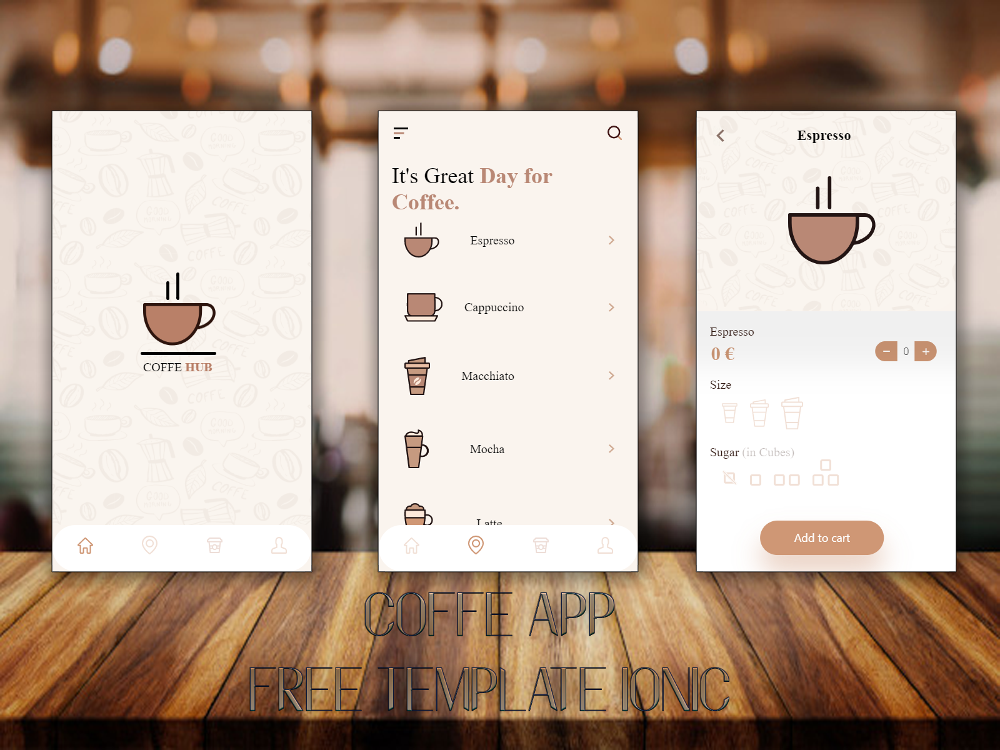
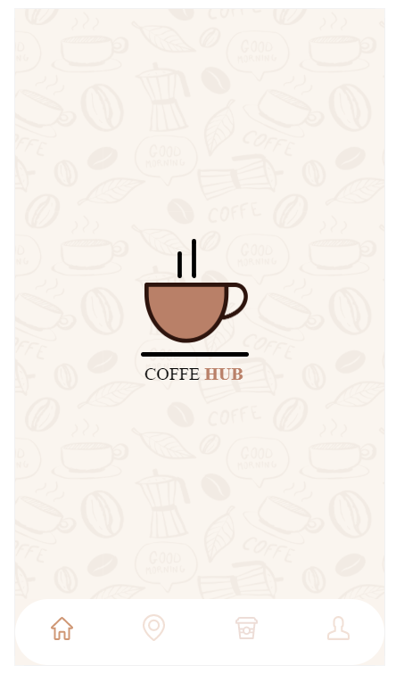
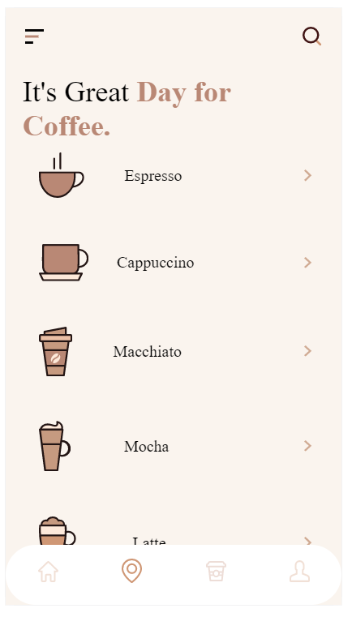
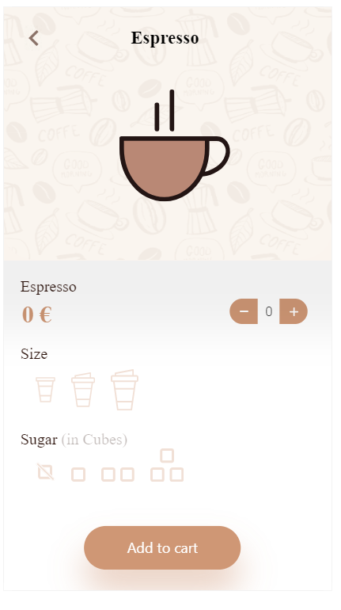

This project: [https://github.com/JoelBM-creator/caffeshop-app](https://github.com/JoelBM-creator/caffeshop-app)
   
You can modify and use this repository however you want   but please refer the creator, thanks ♥ .
 
## Design Web
The project is created with the design idea by Ankur Tripathi:
 
[https://dribbble.com/shots/11469739-Daily-UI-Challenge-065-100-Coffee-Shop-App-Freebie](https://dribbble.com/shots/11469739-Daily-UI-Challenge-065-100-Coffee-Shop-App-Freebie)
 
You can view, her other project in:
[https://dribbble.com/Ankur_007](https://dribbble.com/Ankur_007)
   

## This proyect
This is my second project in GitHub, about Frond End App.  
This is a template created with IONIC & Angular.
   

## About me
Right now, I'm studying in a higher degree of multiplatform application development.
 
"Spring Boot, Java, Hibernate, DBs..."
  
To contact me: [https://www.linkedin.com/in/joel-berenguer/](https://www.linkedin.com/in/joel-berenguer/)
  
## Install modules.
### `npm i`

    
## Available Scripts
In the project directory, you can run:
### `ionic serve`

Runs the app in the development mode. 
Open [http://localhost:8000](http://localhost:8000) to view it in the browser.

The page will reload if you make edits. 
You will also see any lint errors in the console. 

## VIEW DEMO
### `App View`

